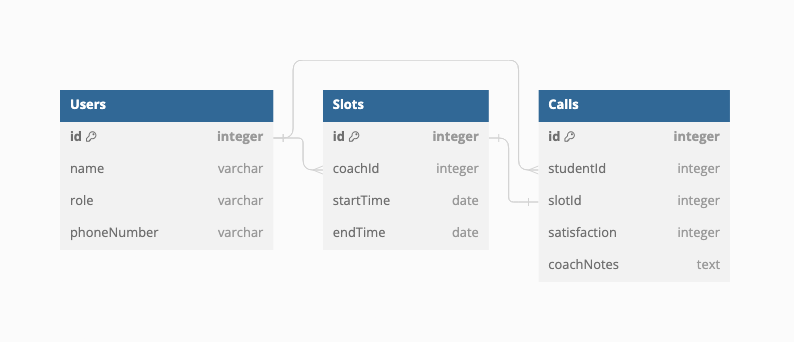

## Coaching Call Scheduler

### User Stories
- Coaches and students have access to separate dashboards.
- Coaches can add availability slots from their dashboard.
- Students can book any available slots from their dashboard.
- Coaches can view their upcoming availability slots as well as upcoming calls and student contact details.
- Students can view upcoming calls and coach contact details.
- Coaches can view their completed calls and document student satisfaction scores and free form notes.

### Technologies
- **Frontend** - React, Zustand, Chakra UI
- **Backend** - Node, Express, Sequelize
- **Database** - PostegreSQL

### ERD

### API Endpoints
- **GET /users** - Fetch all users.
- **POST /slots** - Create a new availability slot.
- **GET /slots/coach/:coachId** - Fetch all slots for a specific coach.
- **POST /calls** - Create a new call.
- **GET /calls** - Fetch all calls.
- **PUT /calls/:callId** - Update a call.

### Considerations for Scalability
- Caching
- Query indexing
- Rate limiting